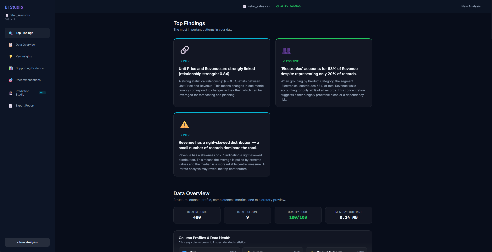
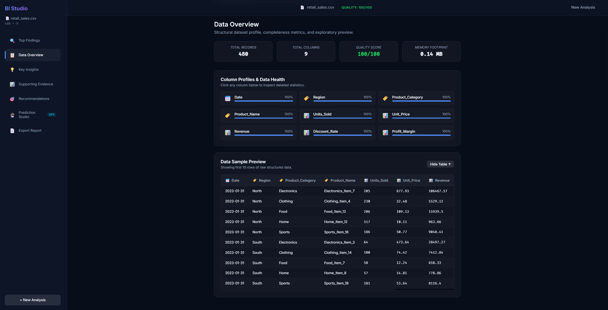
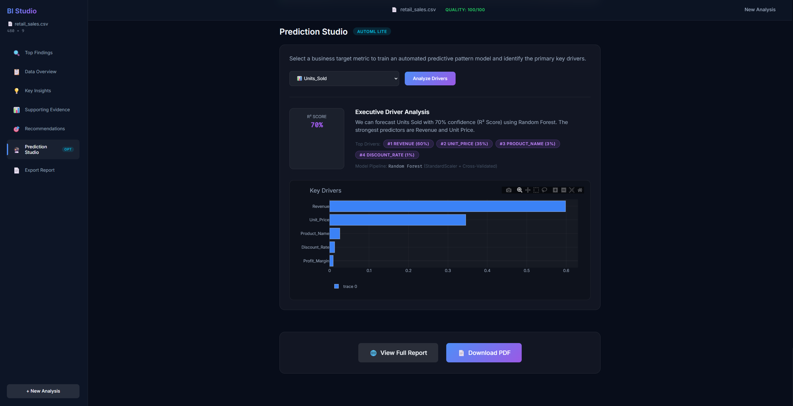
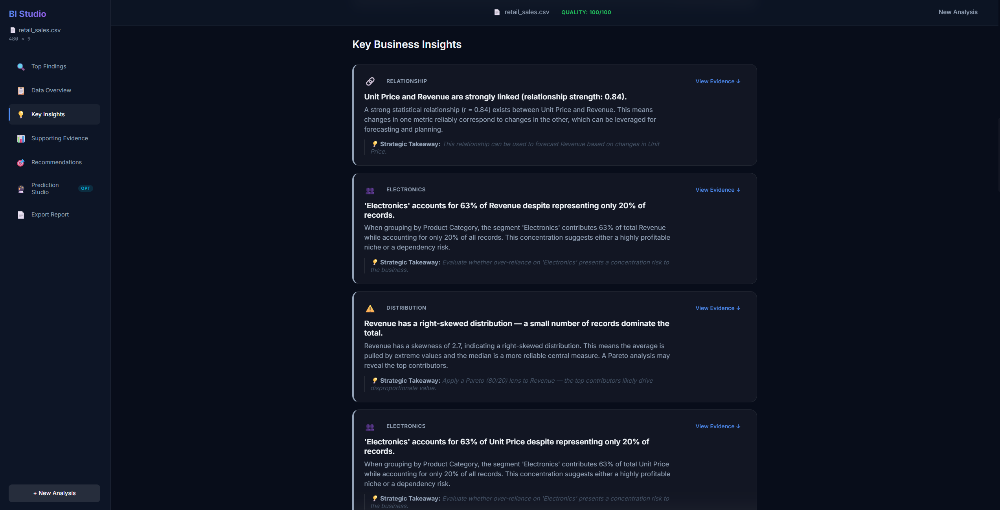

# AI Business Intelligence Studio

> **An AI-assisted Business Intelligence and Data Science platform that transforms raw datasets into quality analysis, statistical insights, visualizations, predictive analysis, and actionable business findings.**

<p align="center">
  <a href="https://ai-business-intelligence-studio.onrender.com" target="_blank">
    
  </a>
</p>

<p align="center">
  <a href="https://github.com/HARIHRITHIK/ai-business-intelligence-studio/actions/workflows/ci.yml"></a>
  
  
  
  
  
</p>

---

## 🚀 Live Demo

> **Live Demo:** [https://ai-business-intelligence-studio.onrender.com](https://ai-business-intelligence-studio.onrender.com)

Explore the full application instantly using preloaded sample datasets (Retail Sales, HR Analytics, Customer Churn) with zero manual setup or file upload required.

See [`DEMO.md`](DEMO.md) for a structured 2-minute recruiter walkthrough.

---

## 📸 Preview

| Full Intelligence Overview | Data Quality & Column Health |
| :---: | :---: |
|  |  |

| Prediction Studio (AutoML Lite) | Business Insights & Strategic Recommendations |
| :---: | :---: |
|  |  |

---

## Problem

Traditional Business Intelligence dashboards are passive grids of charts. They require business stakeholders to manually inspect dozens of graphs, spot anomalies, and interpret what the numbers mean. For non-technical executives, product managers, and founders, this creates a bottleneck between raw data collection and strategic action.

---

## Solution

**AI Business Intelligence Studio** acts as an active **AI Analyst**:
1. Ingests structured business datasets (CSV or Excel).
2. Computes an automated **Data Quality Score (0–100)** and profiles column distributions.
3. Automatically executes statistical discovery tests across all dimensions.
4. Synthesizes and prioritizes the **Top 3 Findings** in plain English with strategic business takeaways.
5. Runs **AutoML Lite** on user-selected targets to identify key metric drivers.
6. Generates high-resolution **visual PDF and interactive HTML reports** on demand.

---

## Key Features

- **🚀 Top Findings First**: Evaluates statistical significance and immediately surfaces the 3 most impactful findings upon dataset ingestion.
- **🛡️ Automated Data Quality Scoring**: Formulates a 0–100 quality index assessing completeness, uniqueness, and column consistency.
- **🔍 Interactive Column Profiler**: Clickable column inspection drawer detailing live statistical distributions (Mean, Median, Std Dev, Min/Max, Skewness, Top Categories).
- **📈 Statistical Pattern Discovery**:
  - **Z-Score Anomaly Detection**: Identifies statistical outliers exceeding $|z| > 3$ thresholds.
  - **Pearson Linear Correlation**: Evaluates relationships across all numerical pairs ($|r| > 0.70$).
  - **Segment Dominance Analysis**: Identifies categories driving disproportionate metric volume.
  - **Distribution Skewness & Class Imbalance**: Measures distribution asymmetry ($|\text{skew}| > 2.0$) and class dominance.
- **🔮 Prediction Studio (AutoML Lite)**:
  - Automatically identifies task type (**Regression** vs. **Classification**).
  - Preprocesses features via median/mode imputation, `LabelEncoder`, and `StandardScaler`.
  - Evaluates cross-validated models (`Ridge`, `LogisticRegression`, `RandomForest`).
  - Ranks normalized feature importances and synthesizes plain-English driver attribution.
- **📄 Sub-Second Report Generation**:
  - 🌐 **Interactive HTML Report**: Responsive full-page report with Plotly.js chart interactions.
  - 📄 **Standalone PDF Report**: Pure-Python Matplotlib/FPDF2 export with embedded chart graphics generated in sub-second time.

---

## Workflow

```
Dataset Ingestion
       ↓
Data Quality Scoring (0–100)
       ↓
Exploratory Profiling
       ↓
Statistical Insight Discovery
       ↓
Interactive Visualization
       ↓
Predictive Driver Modeling (AutoML)
       ↓
Actionable Business Findings
       ↓
Executive Report Export (HTML / PDF)
```

---

## Architecture

```
┌───────────────────────────────────────────────────────────────┐
│                       React + Vite SPA                        │
│  - Glassmorphic Dark UI (#080d1a Design System)               │
│  - Interactive Column Profiler Drawer & Full Data Preview     │
│  - Plotly.js Visualizations & Active Scroll-Spy Navigation    │
│  - AutoML Driver Studio & Instant PDF Export Triggers         │
└───────────────────────────────┬───────────────────────────────┘
                                │ REST API (JSON / Multipart)
┌───────────────────────────────▼───────────────────────────────┐
│                        FastAPI Backend                        │
│  /api/upload                 /api/overview/{session_id}       │
│  /api/samples/{name}         /api/insights/{session_id}       │
│  /api/charts/{session_id}    /api/recommendations/...         │
│  /api/predict/{session_id}   /api/report/html|pdf/...         │
└───────────────────────────────┬───────────────────────────────┘
                                │
        ┌───────────────────────┼───────────────────────┐
        ▼                       ▼                       ▼
   Data Profiler         Insight Engine          Report Generator
(Role Inference,       (Z-Scores, Pearson,     (Pure-Python Matplotlib
Quality Score, Stats)   Segment Dominance)        + FPDF2 Engine)
```

*For in-depth architectural details and data lifecycle flow, see [`docs/ARCHITECTURE.md`](docs/ARCHITECTURE.md).*

---

## Data Science / ML Techniques

| Component | Mathematical / Algorithmic Technique | Implementation |
| :--- | :--- | :--- |
| **Data Quality Index** | Weighted composite: `0.50 × Completeness + 0.30 × Uniqueness + 0.20 × Consistency` | `core/profiler.py` |
| **Anomaly Detection** | Standardized Z-Score thresholding (`z = (x - μ) / σ`, threshold `\|z\| > 3.0`) | `core/insight_engine.py` |
| **Correlation Analysis** | Pearson product-moment correlation coefficient matrix (`\|r\| > 0.70`) | `core/insight_engine.py` |
| **Distribution Skewness** | Adjusted Fisher-Pearson standardized moment coefficient (`\|skew\| > 2.0`) | `core/insight_engine.py` |
| **Feature Preprocessing** | Standard feature scaling (`StandardScaler`), label encoding, median/mode imputation | `core/predictor.py` |
| **Model Selection** | Cross-validated comparison between regularized linear/logistic models and constrained tree ensembles | `core/predictor.py` |
| **Driver Attribution** | Gini impurity decrease & normalized feature coefficient weights | `core/predictor.py` |

---

## Technology Stack

- **Backend**: Python 3.11, FastAPI (ASGI), Uvicorn, Pandas, NumPy, SciPy, Scikit-Learn
- **Reporting Engine**: Matplotlib (Headless Agg backend), FPDF2, Jinja2
- **Frontend**: React 18, Vite, Plotly.js, Axios, React-Dropzone, CSS Custom Properties
- **Testing & CI/CD**: Pytest, GitHub Actions

---

## Sample Use Case

### HR Analytics Dataset (~400 employees)
1. **Quality Check**: Instant 100/100 quality score confirming complete records across 10 columns.
2. **Top Finding Surfaced**: *"Sales accounts for 35% of total attrition despite representing only 22% of headcount."*
3. **Correlation Detected**: Strong negative correlation between `Tenure_Years` and `Attrition`.
4. **Prediction Studio**: Targeting `Attrition` trains a classification model identifying `Monthly_Income` and `Overtime_Hours` as the primary key drivers.
5. **Report Delivery**: 1-click generation of a 3-page executive PDF report with embedded distribution charts.

---

## Testing

The project includes an automated test suite verifying core business logic and REST endpoints:

```bash
cd backend
pytest tests -v
```

- **`backend/tests/test_core.py`**: Unit tests for `DataProfiler`, `InsightEngine`, `AutoMLPredictor`, and pure-Python `ReportGenerator`.
- **`backend/tests/test_api.py`**: Integration tests verifying `/health`, sample loaders, upload validation, prediction, and PDF export.

Continuous integration is automated via GitHub Actions on every push and pull request.

---

## Deployment

The application is structured for lightweight deployment on free-tier cloud platforms (e.g., Render, Railway):

1. **Root Directory**: `backend`
2. **Build Command**: `pip install -r requirements.txt`
3. **Start Command**: `uvicorn main:app --host 0.0.0.0 --port $PORT`

FastAPI automatically serves the compiled React production bundle (`backend/dist`) as static assets with a fallback SPA router.

---

## Limitations

- **In-Memory Session Store**: Sessions are stored in RAM with a 2-hour TTL cleaner. Scaling horizontally across multiple worker nodes would require an external cache (e.g., Redis).
- **Tabular Focus**: Designed specifically for structured tabular data (CSV/Excel) rather than unstructured text or image datasets.
- **Deterministic NLG**: Narrative generation uses statistical template synthesis rather than external LLM APIs, ensuring zero runtime cost and instant execution.

---

## Future Improvements

- [ ] Automated multi-period time-series forecasting (ARIMA / Exponential Smoothing).
- [ ] Exporting cleaned datasets and summary profiling metrics to CSV/JSON.
- [ ] Redis session adapter for multi-container deployment clusters.
- [ ] Optional natural language query interface for ad-hoc dataset questions.

---

## License

Distributed under the MIT License. See [`LICENSE`](LICENSE) for details.
